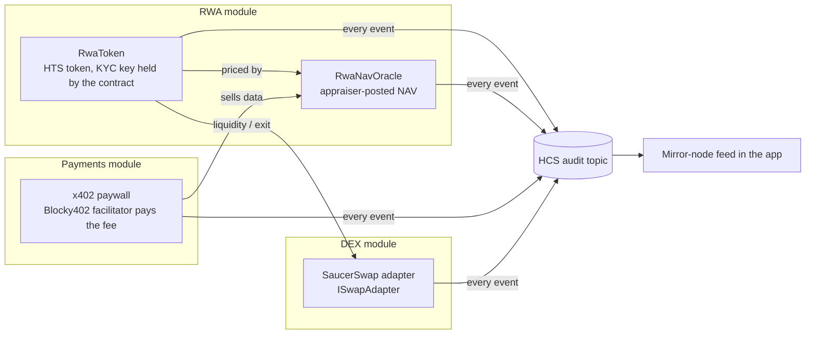

# Hedera DeFi Kit

A modular, provider-agnostic DeFi starter for Hedera, built on [Scaffold-HBAR](https://docs.hedera.com/solutions/tools/scaffold-hbar).
Pick the modules you need, swap providers behind shared interfaces, and let **integration recipes** compose them.

```bash
npx create-scaffold-hbar@latest --template ngempruy/ngempruy
```

> **Unaudited, for education and testnet use.** Do not put real value behind these contracts.

## What makes it different

Each module is useful alone, but the point is how they compose through Hedera-native services:



- **HTS** carries the asset and enforces compliance: KYC is checked by the network itself, not by our Solidity.
- **Smart contracts** hold the HTS admin keys (treasury, KYC, supply) behind on-chain roles, so no issuer key lives on a server.
- **HCS** is the shared audit trail: every kit-contract event and every x402 settlement becomes one message on one topic.
- **x402** turns any API route into a pay-per-request endpoint, settled as a native Hedera transfer with the facilitator paying the fee.

## Live on Hedera testnet

Everything below was produced by `yarn hardhat:deploy`, `yarn demo`, `yarn hardhat:flashloan:demo` and `yarn x402:pay` from one deployer (`0.0.10394443`):

| What                                                        | Link                                                                                                                                  |
| ----------------------------------------------------------- | ------------------------------------------------------------------------------------------------------------------------------------- |
| HCS audit topic (every kit event below lands here)          | [0.0.10843261](https://hashscan.io/testnet/topic/0.0.10843261)                                                                        |
| RWA token (KRES, KYC + supply key = `RwaToken`)             | [0.0.10843354](https://hashscan.io/testnet/token/0.0.10843354)                                                                        |
| `RwaToken` / `RwaNavOracle`                                 | [0.0.10843352](https://hashscan.io/testnet/contract/0.0.10843352) / [0.0.10844802](https://hashscan.io/testnet/contract/0.0.10844802) |
| `SaucerSwapAdapter` (ISwapAdapter)                          | [0.0.10844808](https://hashscan.io/testnet/contract/0.0.10844808)                                                                     |
| RWA/USDC SaucerSwap pair (KYC-granted, seeded at NAV)       | [0.0.10844831](https://hashscan.io/testnet/contract/0.0.10844831)                                                                     |
| `NavBandSwap` (dex+rwa)                                     | [0.0.10844823](https://hashscan.io/testnet/contract/0.0.10844823)                                                                     |
| `SaucerSwapFlashLoan` / `BonzoFlashLoan`                    | [0.0.10844811](https://hashscan.io/testnet/contract/0.0.10844811) / [0.0.10844819](https://hashscan.io/testnet/contract/0.0.10844819) |
| Investor associates the token (HIP-719)                     | [0x3539…354d](https://hashscan.io/testnet/transaction/0x3539c77a97e0de2be719523a0a839c82c7a2e9d16aee02d83b0f4ef80e4a354d)             |
| Compliance grants KYC (audit #17)                           | [0x4599…848d](https://hashscan.io/testnet/transaction/0x4599c3244bc069a226fd6f9a771d7da44ad369a22eaab1ee4b3728d4039a848d)             |
| Issuer issues 10 units (audit #18)                          | [0x5b46…be87](https://hashscan.io/testnet/transaction/0x5b4640ec59c191e9b2d1bbbbd06d53942a9876244117e2350e86edae3818be87)             |
| Appraiser posts NAV $102.01 (audit #19)                     | [0x3536…f4cb](https://hashscan.io/testnet/transaction/0x353647fdb876318e936149249b3a138ba4a06fbe640e6e19b339f274ca4ff4cb)             |
| Buy RWA through `NavBandSwap`, 156 bps over NAV (audit #16) | [0x6719…c223](https://hashscan.io/testnet/transaction/0x6719a6f09e1ccde4551f5d63e1bceeef880b9f1c7246ba0fa58cd603ad83c223)             |
| SaucerSwap flash swap, 1 WHBAR borrowed and repaid          | [0xf14f…63a9](https://hashscan.io/testnet/transaction/0xf14fc08511e18cda7e338bc22a6b8bb4d0efd599a46ec2038711b1ce301763a9)             |
| x402 paid NAV report (`rwa+payments`)                       | [0.0.7162784-1791041416-286483229](https://hashscan.io/testnet/transaction/0.0.7162784-1791041416-286483229)                          |
| x402 settlement (fee paid by Blocky402 `0.0.7162784`)       | [0.0.7162784-1791039263-792561927](https://hashscan.io/testnet/transaction/0.0.7162784-1791039263-792561927)                          |

The scaffolded app is pre-wired to these ids (`packages/nextjs/contracts/`), so the audit feed and RWA page show live data before you deploy anything.

## Quick start

**Prerequisites:** Node.js ≥ 20.18.3, Git, and Yarn (default) or npm. For on-chain steps you need a Hedera testnet account with an **ECDSA** key and some test HBAR from the [portal faucet](https://portal.hedera.com/faucet).

```bash
npx create-scaffold-hbar@latest --template ngempruy/ngempruy
cd <your-project>
yarn next:dev                  # http://localhost:3000, works with no wallet and no .env
```

Then go on-chain:

```bash
yarn hardhat:account:generate  # or hardhat:account:import for an existing ECDSA key
# fund the printed address at https://portal.hedera.com/faucet
yarn hardhat:deploy --network hederaTestnet   # audit topic + selected modules
yarn demo                      # runs every module's flow and prints HashScan links
```

For the web app's server-side actions (audit writes, x402), copy `packages/nextjs/.env.example` to `packages/nextjs/.env.local` and fill it in (see [Environment](#environment)).

## Modules

| Module                       | What you get                                                                                                                                | Hedera services                                | Page                 |
| ---------------------------- | ------------------------------------------------------------------------------------------------------------------------------------------- | ---------------------------------------------- | -------------------- |
| `core` (always on)           | Wallet (RainbowKit + burner), Hedera SDK client, HCS audit log, module nav                                                                  | HCS, mirror node                               | `/modules/core`      |
| `rwa`                        | `RwaToken` (HTS token, contract-held KYC + supply keys, role-gated issuance) and `RwaNavOracle` (NAV per unit, staleness + deviation guard) | HTS system contract `0x167`, HIP-719, Solidity | `/modules/rwa`       |
| `payments`                   | x402 pay-per-request API, capped agent payer, direct HBAR transfers                                                                         | Native transfers, x402 facilitator             | `/modules/payments`  |
| `dex`                        | `SaucerSwapAdapter` behind `ISwapAdapter` (quote, swap, balance-delta output), wrap and swap page                                           | Solidity, HTS association, SaucerSwap V1       | `/modules/dex`       |
| `flashloan` (requires `dex`) | Flash arbitrage / liquidation strategies; SaucerSwap V1 flash swaps (live) and Bonzo Lend `flashLoan` (ready, see gotchas)                  | Solidity, SaucerSwap V1 pairs                  | `/modules/flashloan` |

A module whose required env vars are missing still renders: it shows a setup hint and disables actions that need signing.

### Integration recipes

| Recipe         | Active when          | What it adds                                                                                                                                                                                          |
| -------------- | -------------------- | ----------------------------------------------------------------------------------------------------------------------------------------------------------------------------------------------------- |
| `dex+rwa`      | `dex` and `rwa`      | The RWA/USDC pool with KYC for the pair, seeded at NAV, and `NavBandSwap`: buys only while the price paid is within 2% above the appraised NAV, so a thin or manipulated pool can't overcharge buyers |
| `rwa+payments` | `rwa` and `payments` | `GET /api/x402/nav-report`: the RWA's NAV and appraisal history (decoded `NavPosted` events) sold per request over x402                                                                               |

A recipe lives in `packages/shared/src/integrations/<a>+<b>.ts`, owns its own files, and is removed by `yarn configure` as soon as one of its modules is dropped. Try `rwa+payments` with `yarn x402:pay http://localhost:3000/api/x402/nav-report`; `yarn demo` runs the `dex+rwa` buy, including a refused oversized order.

### Choosing modules

The repo ships with every module enabled. Keep only what you need:

```bash
yarn configure                      # interactive
yarn configure --modules rwa        # non-interactive
yarn configure --modules rwa --dry-run
```

`configure` resolves dependencies (`requires`), rejects conflicts (two modules `provides` the same capability), activates the integration recipes whose modules are all selected, then rewrites `modules.config.ts`, the UI view registry and the generated part of `.env.example`. Finally it deletes the files, package scripts and npm dependencies of everything you dropped. Commit first: pruning deletes files. Run `yarn install` afterwards.

## Environment

`packages/nextjs/.env.local` (server-side; generated keys listed in `.env.example`):

| Variable                     | Module   | Required   | Purpose                                               |
| ---------------------------- | -------- | ---------- | ----------------------------------------------------- |
| `HEDERA_OPERATOR_ID`         | core     | for writes | Account (`0.0.x`) that pays for HCS messages          |
| `HEDERA_OPERATOR_KEY`        | core     | for writes | Its ECDSA private key (hex). Never commit it          |
| `NEXT_PUBLIC_AUDIT_TOPIC_ID` | core     | no         | Overrides the topic recorded by `yarn hardhat:deploy` |
| `X402_PAY_TO`                | payments | yes        | Account that receives x402 payments                   |
| `X402_FACILITATOR_URL`       | payments | no         | Default `https://api.testnet.blocky402.com`           |
| `X402_PRICE_TINYBARS`        | payments | no         | Default `1000000` (0.01 HBAR)                         |

`packages/hardhat/.env` holds `DEPLOYER_PRIVATE_KEY_ENCRYPTED`, written by `hardhat:account:generate` / `hardhat:account:import`. In CI or for agents you can instead export a plain `DEPLOYER_PRIVATE_KEY`; the deploy wrapper then skips the password prompt.

## Architecture

```
packages/
  shared/      @sh/shared: module manifests, resolver, configure logic, audit format (pure TS, tested)
    src/modules/<id>.ts        one manifest per module: requires, provides, contracts, env, owned paths
    src/integrations/<a+b>.ts  recipes, active only when all their modules are selected
    src/modules.config.ts      the selection (generated)
  hardhat/     @sh/hardhat: contracts, deploy steps, tests, demo
    contracts/core/            provider-agnostic interfaces (IPriceOracle, ISwapAdapter)
    contracts/adapters/        provider implementations (Pyth, Chainlink, SaucerSwap, mocks)
    contracts/modules/<id>/    module contracts
    deploy/NN_<id>.ts          one deploy step per module (00 core, 10 rwa, …)
    scripts/demo/<id>.ts       one demo step per module
  nextjs/      @sh/nextjs: the app
    modules/<id>/index.ts      the module's page view (registry generated)
    app/api/audit              turns a confirmed kit tx into HCS audit entries
    app/api/x402/*             paid endpoints
```

**Rules that keep modules composable**

1. A module never imports another module. It talks to shared interfaces (`IPriceOracle`, `ISwapAdapter`) or declares `consumes` and handles the other module being absent.
2. The manifest is the single source of truth: contracts, env vars, owned files, scripts and dependencies all come from it.
3. Combinations get a recipe (`integrations/<a>+<b>`), not `if` statements inside modules.

**The audit pipeline.** After any kit transaction the UI posts its hash to `/api/audit`. The server loads the transaction from the mirror node and accepts it only if it called a contract listed in a module manifest. It then decodes that contract's events with the deployed ABI and writes one HCS message per event. Entries are derived from on-chain data, so a caller cannot forge them. Scripts use the same `auditEntryFromEvent` mapping. x402 settlements are logged from the resource server's `afterSettle` hook.

## Hedera things this template handles for you

- **Association before receiving.** HTS tokens must be associated with an account or contract before it can receive them. Investors associate themselves through HIP-719 (`associate()` on the token address); the UI and demo do this.
- **KYC needs association first.** Granting KYC to an account that is not yet associated fails with HTS code `184` (`TOKEN_NOT_ASSOCIATED_TO_ACCOUNT`). `RwaToken` surfaces it as `HtsCallFailed(selector, 184)`. The order is associate → grant KYC → issue.
- **KYC-key tokens and pools.** Any contract that must hold a KYC-gated token (a DEX pair, router, lending pool) also needs association **and** KYC, granted through `RwaToken.grantKyc`.
- **Pools that hold KYC tokens.** Creating the RWA/USDC pair needs a generous gas limit (the pair associates itself with both tokens; 4M gas fails with `Safe multiple associations failed!`), and the pair must then receive KYC before any liquidity can reach it.
- **Bonzo Lend today.** Testnet deposits revert with `CALLER_NOT_AUTHORIZED` and the mainnet pool is paused (checked 2026-10-03), so SaucerSwap flash swaps are the live flash-loan provider; `BonzoFlashLoan` works unchanged once Bonzo is live.
- **Contract-held keys.** The RWA token's treasury, KYC key and supply key are the `RwaToken` contract (`contractId` keys), so compliance is a role check plus a system-contract call.
- **ECDSA accounts.** Hardhat and EVM wallets need ECDSA (secp256k1) keys. Funding an unknown EVM address auto-creates its account, which is what `yarn demo` does for a fresh investor.
- **Units.** JSON-RPC values are in weibars (1 HBAR = 10¹⁸); the SDK and x402 use tinybars (1 HBAR = 10⁸).
- **x402 is a native transfer.** The client signs a `TransferTransaction` without submitting it. The facilitator co-signs as fee payer and submits. No EVM call is involved.
- **Two testnet USDCs.** SaucerSwap and Bonzo pools use `0.0.5449`; Circle's faucet mints `0.0.429274`, which has no SaucerSwap pool. x402 here is priced in HBAR to avoid that split.
- **Avoided on purpose.** Atomic batch transactions no longer allow arbitrary contract calls (at most one, last, removed entirely in 2027), so composition happens inside contracts. Hooks (HIP-1195) are not live on public networks yet.

**Why an HTS KYC key instead of ERC-3643?** Hedera's Asset Tokenization Studio supports both. A native HTS KYC key is enforced by the network on every transfer, including transfers that never touch our contracts, and keeps the token usable by every HTS-aware wallet and DEX. ERC-3643 is the better fit when you need on-chain identity claims and transfer rules beyond allow/deny.

## Adding a module

1. **Manifest:** `packages/shared/src/modules/<id>.ts`

   ```ts
   export const lending = defineModule({
     id: "lending",
     title: "Lending",
     description: "Borrow against RWA collateral",
     requires: ["core"],
     consumes: ["rwa"],
     provides: ["lending"],
     contracts: ["LendingPool"],
     env: [{ key: "LENDING_MAX_LTV_BPS", description: "Max loan-to-value", required: false }],
     paths: ["packages/shared/src/modules/lending.ts", "packages/hardhat/contracts/modules/lending" /* … */],
   });
   ```

2. **Contracts** in `packages/hardhat/contracts/modules/<id>/`, tests in `packages/hardhat/test/modules/`, deploy step `deploy/NN_<id>.ts`, demo step `scripts/demo/<id>.ts`.
3. **UI** in `packages/nextjs/modules/<id>/` with an `index.ts` that default-exports the view (`{ ready }` prop).
4. Run `yarn configure --modules <all you keep>` to regenerate config, registry and `.env.example`.

Kit-contract events are audit-logged automatically once the contract is listed in the manifest.

**Adding a provider** (a new oracle or DEX): implement the interface in `contracts/adapters/`, add a test with a mock, and deploy it in place of the default. Modules only see the interface.

## Ecosystem coverage

| Area                | Supported now                                                     | Planned slot                                                                                                                          |
| ------------------- | ----------------------------------------------------------------- | ------------------------------------------------------------------------------------------------------------------------------------- |
| DEX / AMM           | SaucerSwap V1 (`ISwapAdapter`)                                    | Silk Suite, memejob, Salt, EtaSwap, Orbit, Lambdaplex: `ISwapAdapter` providers                                                       |
| Oracles             | Pyth, Chainlink Data Feeds, mock (`IPriceOracle`), RWA NAV oracle | Supra (`IPriceOracle`); Chainlink Proof of Reserve when it ships on Hedera                                                            |
| RWA                 | HTS + contract-held KYC key + NAV                                 | Read-only registries for Archax, Securitize, Tokeny, Swarm, Zoniqx, RedSwan, OpenBrick, InvestaX, Byzanlink                           |
| Payments            | x402 (Blocky402, Ax402, x402.org), direct HBAR                    | USDC / USDT0 / AUDD / PHPX / XSGD / FRNT / HUSD as configured assets                                                                  |
| Lending, CDP, yield | Flash loans: SaucerSwap flash swaps (live), Bonzo Lend (ready)    | Bonzo / HLiquity providers; own lending with HIP-1215 scheduled liquidations; CDP stablecoin on RWA collateral; Ichi / YieldFX vaults |
| Staking             | —                                                                 | Native HBAR staking module (SDK only)                                                                                                 |
| Wallets             | RainbowKit + burner (EVM)                                         | HashPack / Kabila via hedera-wallet-connect for native signing                                                                        |
| Bridges             | —                                                                 | Chainlink CCIP, Axelar, LayerZero, HashPort, Squid                                                                                    |

## Testing

```bash
yarn shared:test     # resolver, configure, audit format
yarn hardhat:test    # contracts; HTS is emulated on a testnet fork, KYC through a MockHts at 0x167
yarn lint && yarn format:check && yarn next:check-types
yarn harness:validate # Hedera Harness recipe: static, command and route tiers (.harness/)
```

CI runs all of the above (including the Harness recipe) for the full kit, for every single-module configuration, and for a fresh `create-scaffold-hbar` scaffold with both Yarn and npm (lint, build, boot, routes).

## License

MIT
