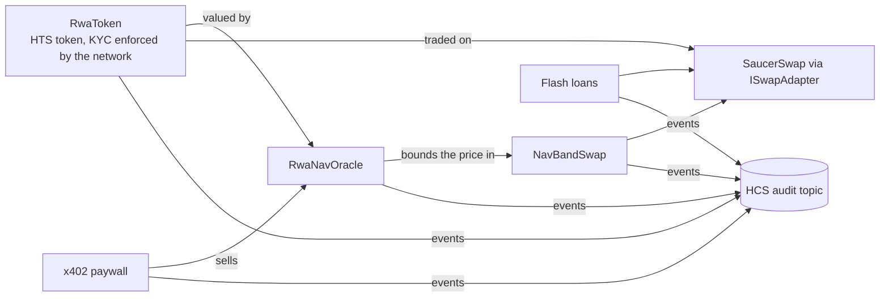

# Hedera DeFi Kit

Modular DeFi building blocks for Hedera: tokenized real-world assets, DEX liquidity, flash loans and pay-per-request APIs. Modules compose through shared interfaces, and every on-chain action is recorded on one HCS audit topic. Built on [Scaffold-HBAR](https://docs.hedera.com/solutions/tools/scaffold-hbar).

```bash
npx create-scaffold-hbar@latest --template ngempruy/ngempruy
```

> **Unaudited.** For education and testnet use only.

## How it fits together



- **HTS** carries the asset. Its KYC, supply and treasury keys belong to a contract, so compliance is an on-chain role check and no issuer key lives on a server.
- **SaucerSwap** provides liquidity and an exit. `NavBandSwap` only buys while the pool price stays within 2% of the appraised NAV.
- **x402** turns API routes into paid endpoints settled as native HBAR transfers; the facilitator pays the fee.
- **HCS** stores one audit trail for every module, derived from on-chain events so it cannot be forged.

## Quick start

Requires Node.js ≥ 20.18.3 and Git. On-chain steps need a Hedera testnet account with an **ECDSA** key, funded from the [portal faucet](https://portal.hedera.com/faucet).

```bash
yarn next:dev                                  # http://localhost:3000, no wallet or .env needed
yarn hardhat:account:generate                  # or hardhat:account:import
yarn hardhat:deploy --network hederaTestnet    # deploy the selected modules
yarn demo                                      # run every module on testnet, print HashScan links
```

Server-side features (audit writes, x402) read `packages/nextjs/.env.local`; copy it from `.env.example`.

## Modules

| Module      | Provides                                                                                           | Hedera                             |
| ----------- | -------------------------------------------------------------------------------------------------- | ---------------------------------- |
| `core`      | Wallet, SDK client, HCS audit log, module navigation                                               | HCS, mirror node                   |
| `rwa`       | `RwaToken` (contract-held KYC and supply keys) and `RwaNavOracle` (staleness and deviation guards) | HTS system contract, HIP-719       |
| `dex`       | `SaucerSwapAdapter` behind `ISwapAdapter`                                                          | SaucerSwap V1                      |
| `flashloan` | Arbitrage and liquidation strategies over SaucerSwap flash swaps; Bonzo Lend provider ready        | SaucerSwap V1, Bonzo               |
| `payments`  | x402 paid API, capped agent payer, direct HBAR transfers                                           | Native transfers, x402 facilitator |

**Recipes** activate when all of their modules are selected:

| Recipe         | Adds                                                                   |
| -------------- | ---------------------------------------------------------------------- |
| `dex+rwa`      | RWA/USDC pool with KYC for the pair, seeded at NAV, and `NavBandSwap`  |
| `rwa+payments` | `GET /api/x402/nav-report`: NAV and appraisal history sold per request |

Keep only what you need. `yarn configure` resolves dependencies, regenerates config and `.env.example`, and deletes the files, scripts and packages of everything else:

```bash
yarn configure --modules rwa,payments
```

## Live on testnet

Deployed by this repo's scripts from account `0.0.10394443`. The scaffolded app ships pre-wired to these, so the audit feed and asset pages show live data immediately.

|                                         |                                                                                                                                                                                                                                                                                                                                                             |
| --------------------------------------- | ----------------------------------------------------------------------------------------------------------------------------------------------------------------------------------------------------------------------------------------------------------------------------------------------------------------------------------------------------------- |
| HCS audit topic                         | [0.0.10843261](https://hashscan.io/testnet/topic/0.0.10843261)                                                                                                                                                                                                                                                                                              |
| RWA token (KYC key held by contract)    | [0.0.10843354](https://hashscan.io/testnet/token/0.0.10843354)                                                                                                                                                                                                                                                                                              |
| RWA/USDC SaucerSwap pool                | [0.0.10844831](https://hashscan.io/testnet/contract/0.0.10844831)                                                                                                                                                                                                                                                                                           |
| Grant KYC → issue → post NAV            | [KYC](https://hashscan.io/testnet/transaction/0xddfc63f2fa7e0b4802ebaee2cabca706a5806ecfe6d4e452e148d25114394966) · [issue](https://hashscan.io/testnet/transaction/0x8e76f822f113519d76a6e289fdeebac219e40b1fc087db94c1cf92ce0aa21251) · [NAV](https://hashscan.io/testnet/transaction/0xa4b344c46f264be88e61ddd2d8229f16b3868ae1615c840c6c2649d72d7faf84) |
| Buy within the NAV band                 | [tx](https://hashscan.io/testnet/transaction/0x468186e314cbe2d3698934653a09c9661e76b93a67f80cf35791bfbb5a36da91)                                                                                                                                                                                                                                            |
| Flash loan (borrow and repay 1 WHBAR)   | [tx](https://hashscan.io/testnet/transaction/0xf14fc08511e18cda7e338bc22a6b8bb4d0efd599a46ec2038711b1ce301763a9)                                                                                                                                                                                                                                            |
| x402 settlement (fee paid by Blocky402) | [tx](https://hashscan.io/testnet/transaction/0.0.7162784-1791041416-286483229)                                                                                                                                                                                                                                                                              |

## Configuration

`packages/nextjs/.env.local`:

| Variable                                      | Purpose                                                                   |
| --------------------------------------------- | ------------------------------------------------------------------------- |
| `HEDERA_OPERATOR_ID`, `HEDERA_OPERATOR_KEY`   | Account that writes audit entries; its key must be the topic's submit key |
| `NEXT_PUBLIC_AUDIT_TOPIC_ID`                  | Optional override of the deployed topic                                   |
| `X402_PAY_TO`                                 | Account that receives x402 payments                                       |
| `X402_FACILITATOR_URL`, `X402_PRICE_TINYBARS` | Optional; default Blocky402 testnet and 0.01 HBAR                         |

The deployer key is stored encrypted in `packages/hardhat/.env`. In CI, export `DEPLOYER_PRIVATE_KEY` instead.

## Architecture

```
packages/shared    module manifests, resolver, configure, audit format
packages/hardhat   contracts (core interfaces, adapters, modules, recipes), deploy steps, demo
packages/nextjs    app: one page per module, /api/audit, x402 routes
```

- A module never imports another; cross-module behavior goes through interfaces (`IPriceOracle`, `ISwapAdapter`) or a recipe.
- The manifest declares everything a module owns (contracts, env vars, files, scripts, dependencies), which is what makes pruning safe.
- `/api/audit` accepts only transactions to kit contracts, verifies them on the mirror node and writes one HCS message per event.

## Hedera notes

- An account must associate an HTS token before receiving it, and must be associated before it can be granted KYC (otherwise HTS returns code 184).
- Contracts that hold a KYC token, such as DEX pairs, need association and KYC too. Creating a pair for a KYC token needs a high gas limit.
- EVM accounts use ECDSA keys. JSON-RPC values are in weibars (10¹⁸ per HBAR); the SDK and x402 use tinybars (10⁸).
- Testnet has two USDC tokens: SaucerSwap pools use `0.0.5449`, Circle's faucet mints `0.0.429274`.
- Bonzo Lend is currently unusable for flash loans (testnet deposits revert, mainnet pool paused), so SaucerSwap flash swaps are the live provider.
- Atomic batches are not used for contract calls (restricted, removed in 2027), and hooks (HIP-1195) are not live yet.

An HTS KYC key is used instead of ERC-3643 because the network enforces it on every transfer, including transfers that never touch these contracts.

## Extending

Add a module with a manifest in `packages/shared/src/modules/<id>.ts`, contracts in `packages/hardhat/contracts/modules/<id>/`, a deploy step, a demo step and a page in `packages/nextjs/modules/<id>/`, then run `yarn configure`. Add a provider by implementing `IPriceOracle` or `ISwapAdapter` in `contracts/adapters/`. See [AGENTS.md](AGENTS.md) for the full conventions.

Planned providers and modules: Supra and Chainlink Proof of Reserve oracles, other Hedera DEXs (Silk Suite, EtaSwap, Orbit), lending with HIP-1215 scheduled liquidations, a CDP stablecoin on RWA collateral, native staking, HashPack and Kabila wallets, and bridges (CCIP, Axelar, LayerZero).

## Development

```bash
yarn lint && yarn format:check && yarn next:check-types
yarn shared:test && yarn hardhat:test
yarn harness:validate     # Hedera Harness recipe in .harness/
```

CI runs these for the full kit, for each single-module configuration, on Node 25, and against a fresh `create-scaffold-hbar` scaffold with Yarn and npm.

## License

MIT
